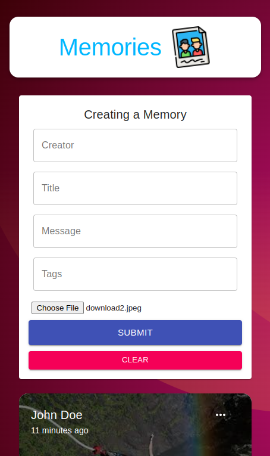

<div align="center">
  

  ## Memories Project

[](https://memories-project-eight.vercel.app/)

  
  
</div>

## ✨ Tecnologies

- [React](https://pt-br.reactjs.org/)
- [Scss/Sass](https://sass-lang.com/)
- [Typescript](https://www.typescriptlang.org/)
- [Vite](https://vitejs.dev/)

## 🚀 Run the project

```bash
# Clone the project from Github
git clone https://github.com/DanteBenicio/memories-project

# Access the project folder
cd memories-project

# Install the project dependencies
yarn
or
npm install

# Run the project (port 3000 - http://localhost:3000)
yarn dev
or
npm run dev
```